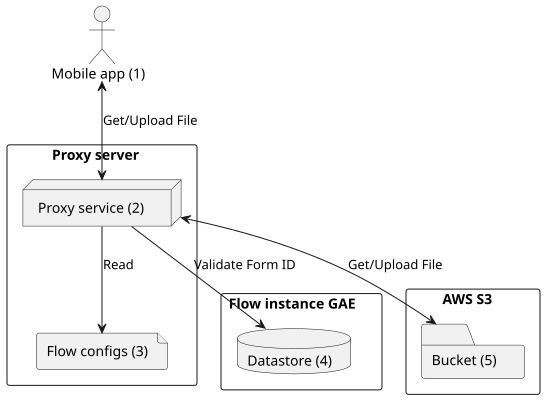
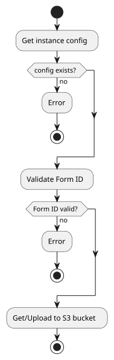

# Welcome to "Akvo Flow S3 Proxy" Documentation

Akvo Flow S3 Proxy is a service used by Flow mobile app to upload and get files from S3 bucket.


## Development

### Prerequisite

* Docker
* Docker Compose

### Environment Setup

* Expected that PORT 5000 is not being used by other service
* You need to have access to the `akvo-flow-server-config` repository

###  Commands

* `docker compose up -d` - Start the development server container in the background
* `./scripts/test.sh` - Run code linting and automated testing
* `./scripts/update-deps.sh` - Update the project dependencies

### Adding or updating python package dependency

Project dependencies are specified in the `backend/pyproject.toml` file. The `backend/requirements.txt`
and `backend/requirements-dev.txt` should not be edited manually.

Add the package to the list on the `dependencies` field to add production dependencies.

```toml
[project]
dependencies = [
  # add production package here
]
```

Add the package to the `dev` list under `optional-dependencies` section to add development dependencies.

```toml
[project.optional-dependencies]
dev = [
  # add development package here
]
```

Run `./scripts/update-deps.sh` to regenerate the `backend/requirements.txt` and
`backend/requirements-dev.txt` files.


## Architecture




### Components

1. **Mobile app**:
   Is the main client of the proxy server.
2. **Proxy service**:
   Acts as a gateway from Flow mobile apps to S3 buckets.
3. **Flow config**:
   Stores credentials of each instance and other necessary attributes.
4. **Datastore**:
   Used by proxy server to validate Form ID parameter.
5. **S3 Bucket**:
   As a place that is ultimately used by mobile applications to store and retrieve files.


### How it work

Each Flow instance has a specific mobile app and an S3 bucket with a restricted access policy. The proxy server will act as a gateway from all Flow mobile app instances to their respective bucket of those instances. So sensitive data related to the S3 bucket does not need to be stored in the mobile app.

The proxy server stores a config map from all Flow instances generated from the private config repo. It also has an endpoint for regenerating the configuration to keep the config map in sync with the config repository. This endpoint will then be used in the configuration repo webhook and will be triggered when a change is committed.

The endpoints on the proxy server have parameters consisting of a Flow instance ID and a form ID. The Flow instance ID is used to identify which bucket to access and which configuration to use. The Form ID will be used by the proxy server to query the Flow instance's Datastore and check the validity of the form. The request will be rejected if the Form ID is invalid.




## Deployment

### Deploy to test server

When the code is committed/merged to the main branch and the CI build passes, it will then be deployed to the testing server.


### Release to production

Create a code release on [https://github.com/akvo/akvo-flow-s3-proxy/releases](https://github.com/akvo/akvo-flow-s3-proxy/releases). Approval is required before the code is published to the production server.
